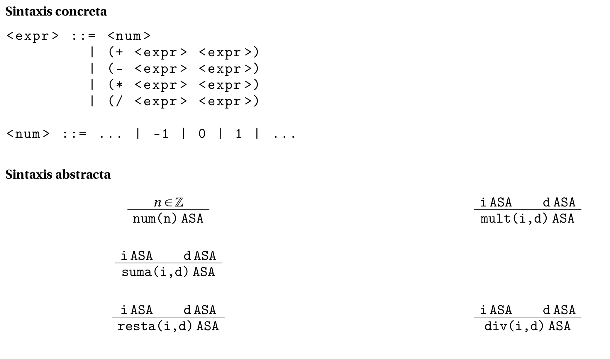

[`Lenguajes de Programación`](../../README.md) > [`Unidad 1`](../README.md) > Generación de código ejecutable

# Generación de código ejecutable

Una vez que tenemos el diseño de un lenguaje de programación mediante su especificación formal, procedemos a darle vida, para ello necesitamos *generar código ejecutable*.

Para ejemplificar todos los conceptos asociados a la generación de código ejecutable, integraremos la especificación de la sintaxis y semántica de **MiniLisp**. Las fases en general que seguiremos para diseñar nuestros lenguajes de programación son:

1. Especificación de la sintaxis.
1. Especificación de la semántica.
1. Elección del lenguaje anfitrión.
1. Implementación del análisis léxico.
1. Implementación del análisis sintáctico.
1. Implementación del análisis semántico.
1. Integración.

## Especificación de la sintaxis

Como vimos en el Tema 4, la especificación de la sintaxis se da en dos partes: *Sintaxis concreta* y *sintaxis abstracta*. A continuación la especificación de ambos tipos de sintaxis para **MiniLisp**:



## Especificación de la semántica

Como vimos en los Temas 5 y 6, la especificación de la sintaxis puede darse usando un enfoque operacional de dos maneras: natural o estructural. Para los fines de una implementación siempre es más conveniente trabajar con una semántica natural, mientras que para realizar pruebas sobre el lenguaje, es más conveniente usar una semántica estructural. A continuación la semántica natural de **MiniLisp**:


## Elección del lenguaje anfitrión

Ahora que tenemos el diseño de nuestro lenguaje por medio de la especificación de la sintaxis y la semántica, procedemos a realizar la implementación. Dentro de esta implementación tenemos dos lenguajes de programación involucrados:

- **Lenguaje objetivo:** Es el lenguaje para el cual daremos la implementación, el que estamos diseñando, en este caso el lenguaje **MiniLisp**.

- **Lenguaje anfitrión:** El que usaremos para lograr la implementación, el que hará todo el trabajo tras bambalinas. Por ejemplo el lenguaje anfitrión de **Java** es **C**. En nuestro caso usaremos **Haskell** como lenguaje anfitrión.

## Análisis léxico

En esta etapa tenemos básicamente las siguientes fases:

- Se analiza la entrada caracter a caracter y se divide en una serie de unidades elementales: los componentes léxicos llamados *lexemas* o *tokens*.

- Cada token se clasifica en una categoría y puede recibir uno o más atributos con informaciń relevante para otras fases.

Definiremos el analizador léxico por medio de una función `lexer`:

```haskell
lexer :: String -> [Token]
```

Nuestra función `lexer` requiere antes que nada la definición del tipo `Token` que representa los tokens a capturar dentro del lenguaje.

```haskell
data Token = TokenNum Int
           | TokenSuma
           | TokenResta
           | TokenMult
           | TokenDiv
           | TokenPA
           | TokenPC
           deriving(Show)
```

Definimos entonces la función `lexer`. Esta función lee caracter a caracter y clasifica cada una de las cosas que encuentra en una categoría dependiendo del tipo de token correspondiente.

```haskell
lexer :: String -> [Token]
lexer [] = []
lexer (' ' : xs) = lexer xs
lexer ('(' : xs) = TokenPA:(lexer xs)
lexer (')' : xs) = TokenPC:(lexer xs)
lexer ('+' : xs) = TokenSuma:(lexer xs)
lexer ('-' : xs) = TokenResta:(lexer xs)
lexer ('*' : xs) = TokenMult:(lexer xs)
lexer ('/' : xs) = TokenDiv:(lexer xs)
lexer (x:xs)
    | isDigit x = lexNum (x:xs)

lexNum :: String -> [Token]
lexNum cs = TokenNum (read num) : lexer rest
      where (num,rest) = span isDigit cs
```

```bash
> lexer "1729"
> [TokenNum 1729]
> lexer "(+ 18 35)"
> [TokenPA, TokenSuma, TokenNum 18, TokenNum 35, TokenPC]
> lexer "(+ (- 4 0) (* 5 5))"
> [TokenPA, TokenSuma, TokenPA, TokenResta, TokenNum 4, TokenNum 0, TokenPC, TokenPA, TokenMult, TokenNum 5, TokenNum 5, TokenPC, TokenPC]
```

## Análisis sintáctico

Partiendo de los componentes léxicos, en esta fase se conforman las estructuras presentes en el código de acuerdo con una gramática de la sintaxis concreta. Se construye el ASA correspondiente.

En análisis sintáctico en general puede complicarse de lenguaje a lenguaje, por lo que hoy en día existen diversas herramientas que nos pueden ayudar a realizar este proceso sin mucho esfuerzo. Tu curso de **Compiladores** profundizará mucho en cómo es que trabajan estas herramientas.

Sin embargo, debe quedar claro que el proceso en general, consiste en recorrer los componentes léxicos y construir la estructura de árbol correspondiente.

Para representar los ASA en **Haskell** haremos uso del siguiente tipo de dato, mismo que se basa en la especificación de la semántica abstracta.

```haskell
data ASA = Num Int
          | Suma ASA ASA
          | Resta ASA ASA
          | Mult ASA ASA
          | Div ASA ASA
          deriving(Show)
```

En este curso haremos uso de la herramienta [**Happy** 🙂](https://www.haskell.org/happy/) que permite generar analizadores sintácticos en **Haskell**. 

---

> 📝 **Actividad.**   
> Revisa el capítulo [Using Happy](https://www.haskell.org/happy/doc/html/sec-using.html) de la documentación de Happy.

---

A continuación se muestra el archivo de entrada para **Happy**. Requiere la especificación del analizador léxico, los árboles de sintaxis abstracta y genera como salida una función `parse` que se encarga de generar nuestros ASA.

```haskell
{
module Grammars where

import Data.Char
}

%name parse
%tokentype { Token }
%error { parseError }

%token 
      int             { TokenNum $$ }
      '+'             { TokenSuma }
      '-'             { TokenResta }
      '*'             { TokenMult }
      '/'             { TokenDiv }
      '('             { TokenPA }
      ')'             { TokenPC }

%%

ASA : int                  { Num $1 }
    | '(' '+' ASA ASA ')'  { Suma $3 $4}
    | '(' '-' ASA ASA ')'  { Resta $3 $4}
    | '(' '*' ASA ASA ')'  { Mult $3 $4}
    | '(' '/' ASA ASA ')'  { Div $3 $4} 

{

parseError :: [Token] -> a
parseError _ = error "Parse error"


data ASA = Num Int
          | Suma ASA ASA
          | Resta ASA ASA
          | Mult ASA ASA
          | Div ASA ASA
          deriving(Show)

data Token = TokenNum Int
           | TokenSuma
           | TokenResta
           | TokenMult
           | TokenDiv
           | TokenPA
           | TokenPC
           deriving(Show)

lexer :: String -> [Token]
lexer [] = []
lexer (' ' : xs) = lexer xs
lexer ('(' : xs) = TokenPA:(lexer xs)
lexer (')' : xs) = TokenPC:(lexer xs)
lexer ('+' : xs) = TokenSuma:(lexer xs)
lexer ('-' : xs) = TokenResta:(lexer xs)
lexer ('*' : xs) = TokenMult:(lexer xs)
lexer ('/' : xs) = TokenDiv:(lexer xs)
lexer (x:xs)
    | isDigit x = lexNum (x:xs)

lexNum :: String -> [Token]
lexNum cs = TokenNum (read num) : lexer rest
      where (num,rest) = span isDigit cs

main = getContents >>= print . parse . lexer

}
```

```bash
> parse $ lexer "1729"
Num 1729
> parse $ lexer "(+ 18 35)"
Suma (Num 18) (Num 35)
> parse $ lexer "(+ (- 4 0) (* 5 5))"
Suma (Resta (Num 4) (Num 0)) (Mult (Num 5) (Num 5))
```

## Análisis semántico

Toma en cuenta el ASA y comprueba si, además de las restricciones sintáctica, se cumplen otras restricciones impuestas por el lenguaje y que no pueden ser comprobadas mediante una gramática libre de contexto. El resultado puede resultar en un nuevo árbol o en el resultado final, como es el caso de nuestro lenguaje.

Algunos ejemplos de estas restricciones son la necesidad de declarar variables antes de usarlas, las reglas de tipos o la coincidencia entre los parámetros de las funciones en las definiciones y las llamadas. En el caso de este lenguaje, no es necesario verificar ninguna restricción adicional.

Procedemos entonces a evaluar las expresiones usando las reglas definidas en la especificación de la semántica natural. El mapeo se da mediante la función `interp`:

```haskell
interp :: ASA -> Int
interp (Num n) = n
interp (Suma i d) = interp i + interp d
interp (Resta i d) = interp i - interp d
interp (Mult i d) = interp i * interp d
interp (Div i d) = div (interp i) (interp d)
```

```bash
> interp $ parse $ lexer "1729"
1729
> interp $ parse $ lexer "(+ 18 35)"
53
> interp $ parse $ lexer "(+ (- 4 0) (* 5 5))"
29
```

## Integración

Consiste en integrar todos los componentes anteriores en un único programa. Recordando que nuestro programa está siendo traducido por un intérprete, colocaremos todo en un programa [REPL](https://es.wikipedia.org/wiki/REPL), cuyo código se muestra a continuación:

```haskell
module REPL where

import Grammars
import Interp

-- Función encargada de llevar la ejecución del programa mediante los siguientes pasos:
-- 1. Impresión del propt.
-- 2. Lectura de una cadena.
-- 3. Si la cadana es igual a ":q", se cierra el intérprete.
-- 4. En caso contrario, realiza la generación de código ejecutable aplicando los análisis en
--    orden siguiente: léxico, sintáctico, semántico.
-- 5. Vuelve a ejecutar el ciclo.
repl = 
    do
        putStr "> "
        str <- getLine
        if str == "(exit)" then 
            putStrLn "Bye." 
        else 
            do
                putStrLn $ show (interp (parse (lexer str)))
                repl

-- Función principal. Da la bienvenida al usuario y ejecuta el REPL.
run =
    do
        putStrLn "Mini-Lisp v1.0. Bienvenidx." 
        repl
```

👉 [**Descarga aquí el código de MiniLisp**](codigo)

Para correr el intérprete terminado ejecuta:

```bash
> happy Grammars.y 
> ghci REPL.hs 
GHCi, version 8.6.5: http://www.haskell.org/ghc/  :? for help
[1 of 3] Compiling Grammars         ( Grammars.hs, interpreted )
[2 of 3] Compiling Interp           ( Interp.hs, interpreted )
[3 of 3] Compiling REPL             ( REPL.hs, interpreted )
Ok, three modules loaded.
*REPL> run
Mini-Lisp v1.0. Bienvenidx.
> 1729
1729
> (+ 18 35)
53
> (+ (- 4 0) (* 5 5))
29
> (exit)
Bye.
*REPL> 
```

[`Anterior`](../README.md) | [`Siguiente`](../laboratorio02/README.md)
