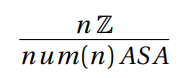
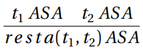
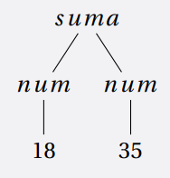
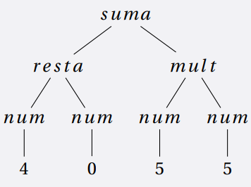

[`Lenguajes de Programación`](../../README.md) > [`Unidad 1`](../README.md) > Sintaxis

# Sintaxis

## Introducción

Nuestro principal objetivo es diseñar y formalizar lenguajes para poder analizar propiedades sobre los mismos. La forma en que haremos esto es estudiando el diseño de distintos lenguajes. 

Para cada uno de éstos realizaremos lo siguiente:

- Daremos la especificación formal de su sintaxis.

- Discutiremos y formalizaremos su semántica.

- Discutiremos brevemente las ideas detrás de su implementación.

En realidad trabajaremos con un subconjunto de un único lenguaje durante el desarrollo de estas notas: **Lisp**. Iremos incrementando poco a poco sus funcionalidades y discutiendo las decisiones de diseño sobre el mismo. 

**Lisp** fue creado por John McCarthy y es el primer lenguaje funcional de la historia, tiene cierta influencia del Cálculo λ e incluye asignación de variables, lo cual lo hace perfecto para estudiar conceptos de lenguajes que caen dentro de los estilos declarativo e imperativo aunque ocasionalmente haremos mención de otros lenguajes.

En este tema aprenderemos a dar la especificación de la sintaxis de lenguajes de programación así como algunos detalles (mínimos) sobre su implementación.

Para ejemplificar los conceptos comenzaremos añadiendo al lenguaje expresiones aritméticas: números, sumas, restas, multiplicaciones y divisiones. Básicamente una calculadora sencilla.

## Especificando la sintaxis

La sintaxis de un lenguaje se refiere a la forma correcta de escribir las instrucciones. Para definirla utilizaremos dos clases de objetos:

- Las cadenas para definir la *sintaxis concreta* que representa al programa dado por aquellas personas que vayan a usar nuestro lenguaje de programación.

- Los *Árboles de Sintaxis Abstracta (ASA)* para modelar la estructura jerárquica de la sintaxis y que la computadora pueda entender de forma sencilla el programa escrito por lxs programadorxs.

### Sintaxis concreta

La sintaxis concreta de un lenguaje de programación se determina usualmente en dos partes.

---

> 🌟 **Definición.**   
> *La __sintaxis léxica__ describe la construcción de lexemas (átomos, tokens, símbolos terminales). Por ejemplo, palabras reservadas, identificadores, numerales, literales, espacios, etc. La principal herramienta para su descripción son las expresiones regulares.*

---

> 🌟 **Definición.**   
> *La __sintaxis libre de contexto__ describe la construcción de frases del lenguaje. Por ejemplo, expresiones, definiciones, declaraciones, etc. La principal herramienta para la descripción son las gramáticas libres de contexto, por lo general en la forma normal extendida de Backus-Naur (EBNF).*

---

Dados estos conceptos, podemos definir ahora la sintaxis concreta de esta versión de **MiniLisp**.

Al ser un subconjunto (muy pequeño y muy poco potente) de **Lisp**, usa notación prefija y paréntesis, lo cual nos ahorrará el problema de ambigüedad en nuestras gramáticas que se estudia en los cursos de Autómatas y Lenguajes Formales. A continuación la gramática del lenguaje en EBNF: 

```lisp
<expr> ::= <num>
         | (+ <expr> <expr>)
         | (- <expr> <expr>)
         | (* <expr> <expr>)
         | (/ <expr> <expr>)
```

---

> 👨‍🔬 **Ejemplo.**
> Algunas expresiones del lenguaje junto a su derivación
>
> - `1729`
> 	```lisp
>	<expr>
>	=> <num>
>	=> 1729
>	```
> - `(+ 18 35)`
>	```lisp
>	<expr>
>	=> (+ <expr> <expr>)
>	=> (+ <num> <expr> )
>	=> (+ 18 <expr>)
>	=> (+ 18 <num>)
>	=> (+ 18 35)
>	```
> - `(+ (- 4 0) (* 5 5))`
>	```lisp
>	<expr>
>	=> (+ <expr> <expr>)
>	=> (+ (- <expr> <expr>) <expr>)
>	=> (+ (- <num> <expr>) <expr>)
>	=> (+ (- 4 <expr>) <expr>)
>	=> (+ (- 4 <num>) <expr>)
>	=> (+ (- 4 0) <expr>)
>	=> (+ (- 4 0) (* <expr> <expr>))
>	=> (+ (- 4 0) (* <num> <expr>))
>	=> (+ (- 4 0) (* 5 <expr>))
>	=> (+ (- 4 0) (* 5 <num>))
>	=> (+ (- 4 0) (* 5 5))
>	```
> 
> Notemos que la derivación de cada una de las expresiones es única, lo cual nos permite observar que la gramática no es ambigua.

---

### Sintaxis abstracta

La sintaxis abstracta proporciona una representación que la computadora
puede manipular de forma más sencilla que al procesar cadenas. Dicha representación es usualmente dada por estructuras llamadas *Árboles de Sintaxis
Abstracta (ASA)*, los cuáles son más simples de leer y manipular. El ASA de una
expresión captura el orden en que se realizarán las operaciones mediante el uso
de operadores que determinan la forma más externa de cualquier expresión
dada, ya que adopta una notación prefija. Por lo anterior, elimina el uso de paréntesis de la sintaxis concreta. Además es único para cualquier expresión, sin
importar su representación concreta. De ahí que la gramática no sea [ambigua](https://es.wikipedia.org/wiki/Gram%C3%A1tica_ambigua).

Un ASA es básicamente un árbol ordenado cuyos nodos están etiquetados por
un operador. Cada operador tiene un índice asignado que indica el número
de argumentos que recibe, los cuales corresponden al número de hijos de cualquier nodo etiquetado con él. Para especificar los ASA usaremos juicios y
reglas que definen inductivamente a nuestros árboles, sin embargo, puede ser
de gran utilidad dibujar los mismos. Veamos esta notación:

- **Números**. Usaremos la etiqueta *num* para representar números. De esta
forma *num (n)* es un *ASA* que almacena un número entero *n*.

   

- **Suma**. Usaremos la etiqueta *suma* para representar la operación de suma. De esta forma *suma (t<sub>1</sub>,t<sub>2</sub>)* es un *ASA* que almacena una expresión
izquierda (otro árbol) *t<sub>1</sub>* y una expresión derecha (otro árbol) *t<sub>2</sub>*.

   

   El mismo razonamiento aplica para el resto de operadores.

- **Resta**.

   

- **Multiplicación**.

   

- **División**.  

    

---

> 👨‍🔬 **Ejemplo.**
> ASAs de las expresiones del ejemplo anterior:
>
>- Sintaxis concreta: `1729`   
>   Sintaxis abstracta: `num(1729)`   
>   Representación gráfica:   
>   
>
>- Sintaxis concreta: `(+ 18 35)`   
>   Sintaxis abstracta: `suma(num(18),num(35))`   
>   Representación gráfica:   
>    
>
>- Sintaxis concreta: `(+ (- 4 0) (* 5 5))`   
>   Sintaxis abstracta: `suma(resta(num(4),num(0)),mult(num(5),num(5)))`   
>   Representación gráfica:   
>    

---

La especificación de la sintaxis mediante esta notación nos permite estudiar
propiedades interesantes sobre los lenguajes. Hablaremos de esto en otra nota
cuando añadamos más elementos a nuestro lenguaje.

---

> 📚 **Referencias**
>
> 1. Araceli L., Reyes, *Un lenguaje para expresiones aritméticas (EA): Construcción de un intérprete y compilador*, UACM, 2020.
> 1. Shriram Krishnamurthi, *Programming Languages Application and Interpretation*, Brown University, Primera Edición 2007.

---

[`Anterior`](../tema03/README.md) | [`Siguiente`](../tema05/README.md)
