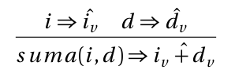
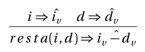
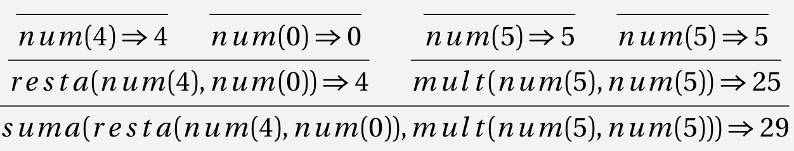

[`Lenguajes de Programación`](../../README.md) > [`Unidad 1`](../README.md) > Semántica Natural

# Semántica Natural

## Introducción

En el tema anterior aprendios a dar la especificación de la sintaxis. Tenemos hasta este punto dos cosas:

1. La sintaxis concreta que permite a lxs programadorxs escribir programas en nuestro lenguaje.

1. La sintaxis abstracta que permite a la computadora comprender de manera jerárquica y estructura los programas escritos por el programador en forma de árbol.

Ahora daremos la especificación de la semántica que nos permitirá definir el comportamiento de nuestros programas.

Por *semántica* nos referimos, en resumidas palabras, al significado que se le da a lo escrito. Por ejemplo la expresión `(* (+ 2 3) 5)` se entiende como *multiplicar 3 con 5 y sumar 2*, lo cual da como resultado 17. En pocas palabras es la interpretación (evaluación) de una expresión con la suposición de que hubo una revisión previa de la sintaxis que nos indica que las expresiones pertenecen al lenguaje correspondiente. Ejemplos de semántica que seguramente has tratado a lo largo de tu licenciatura son:

- Interpretación de símbolos matemáticos.
- Interpretación de símbolos en el diseño de circuitos digitales.
- Interpretación de fórmulas proposicionales.
- Interpretación de fórmulas de distintos sistemas lógicos.

---

> 📝 **Actividad.**   
> Da otro ejemplo donde la semántica haya estado presente en tu vida académica.

---

Es natural preguntarse entonces:

*¿Cómo especificamos la semántica de un lenguaje?*

## Formas de especificar semántica

En general, podría hacerse mediante alguna de las siguientes formas:

### Lenguaje natural
Se explica con palabras lo que debe hacerse para dar un significado a las expresiones del lenguaje.

---

> 👨‍🔬 **Ejemplo.**   
> Semántica para interpretar las fórmulas de la lógica proposicional:
>
> *Para interpretar una fórmula proposicional, sustituimos las variables por su estado correspondiente y aplicamos los operadores respectivos.*

---

Quizá esta sea la forma más fácil de especificar la semántica de un lenguaje, sin embargo, no está exenta de ambigüedades y depende de la subjetividad de cada hablante. Por ejemplo ¿qué significa estado? ¿cómo aplicamos los operadores? ¿qué es un operador?.

### Implementando un intérprete
Quizá la solución más *computóloga* que nos puede venir a la mente es escribir un intérprete para entender el significado de las expresiones del lenguaje. 

---

> 👨‍🔬 **Ejemplo.**   
> Intérprete para fórmulas proposicionales en **Haskell**:
>
> ```haskell
> interp :: LProp -> Bool
> interp Bottom = False
> interp Top = True
> interp (Not p) = not (interp p)
> interp (And p q) = (interp p) && (interp q)
> interp (Or p q) = (interp p) || (interp q)
> ...
> ```

---

Al escribir un intérprete de cierta forma nos estamos adaptando al lenguaje de programación en el que se da la implementación, cosa poco deseada pues ésta cambiará de lenguaje a lenguaje (aún siendo las mismas reglas), esto debido al estilo de programación o propósito con el cual fue definido el lenguaje.


Evidentemente necesitamos una mejor técnica para describir el comportamiento de las expresiones de un lenguaje que además sea sencillo de trasladar a un lenguaje de programación. Dicho de otras formas, necesitamos de un lenguaje universal. Este lenguaje universal y sobre todo *formal* existe y son las matemáticas.

## Niveles de semántica

Normalmente consideramos dos niveles de semántica.

### Semántica dinámica
Determina el valor o evaluación de un programa. Existen tres estilos básicos para definri la semántica dinámica de un lenguaje de programación:

- **Semantica operacional.** Define el comportamiento de un programa en términos de sus operaciones. Indica *cómo* evaluar las expresiones de un lenguaje.

- **Semántica denotativa.** Asocia las expresiones con objetos matemáticos como números, conjuntos, funciones, etc.

- **Semántica axiomática.** Es un enfoque basado en la lógica para probar que un programa es correcto.

En estas notas obtaremos por usar un estilo operacional para definir la semántica de nuestros lenguajes. Si se desea conocer más sobre el resto de estilos, se recomienda llevar el curso de **Semántica y Verificación**.

### Semántica estática
Dependiendo del lenguaje, permite realizar la verificación de propiedades semánticas estáticamente (sin ejecutar el código), por ejemplo:

- Detectar la existencia de variables libres.
- La correctud de los tipos de un programa.

Esta verificación es necesaria para poder definir la semántica de las instrucciones de manera simple y eficaz. Antes de definir el significado preciso de un programa, es necesario eliminar los programas sin sentido, por ejemplo, si el lenguaje tiene anotaciones de tipo explícitas, entonces su semántica dinámica estará definida si el programa en cuestión está bien formado con respecto a la semántica estática.

Profundizaremos en este tema cuando nuestro lenguaje lo permita.

Dicho de otro modo:

- La **Semántica estática** realiza verificaciones al programa para garantizar que tenga sentido en **Tiempo de compilación**.
- La **Semántica dinámica** especifica cómo se comportará un programa (con sentido) en **Tiempo de ejecución**.

## Semántica Operacional de Paso Grande para MiniLisp
Al igual que como hicimos con la sintaxis abstracta, especificaremos la semántica operacional por medio de reglas de inferencia. Definiremos estas reglas sobre la sintaxis abstracta del lenguaje pues así es como se llevará a la vida.

Definimos entonces al jucio:

<center></center>

*El ASA a se reduce al valor v*

### Reglas
Incluimos la descripción en lenguaje natural, sin embargo la idea es que te familiarices con la notación en lenguaje formal. 

- **Números.** Los ASA que representan números se reducen al número que captura la etiqueta *num*. El gorrito sobre la *n* indica que en realidad se reduce al numeral correspondiente en el lenguaje que lo implementa.

	<center></center>

- **Sumas**. Los ASa que representan sumas se reducen a aplicar la suma de la evaluación del lado izquierdo y derecho de las mismas.

	<center></center>

	La conclusión es verdadera si *l*<sub>*v*</sub> y *r*<sub>*v*</sub> son las reducciones del lado izquierdo y derecho de la suma respectivamente.

- **Restas**. Este caso es análogo al de la suma.

	<center></center>

- **Multiplicaciones**. Este casoes análogo al de la suma.

	<center></center>

- **Divisiones**. Este caso es parcialmente análogo al de la suma, pues tenemos que añadir un juicio especial que verifique que el segundo argumento de la división sea distinto de cero. 

	<center></center>

Esta notación recibe el nombre de *semántica operacional de paso grande* o simplemente *semántica natural*. Se dice que es de paso grande pues los resultados son irreducibles, es decir, relaciona programas con su resultado.

---

> 👨‍🔬 **Ejemplo.**   
> Derivación de las expresiones del tema anterior usando nuestra semántica natural.
>
> - Sintaxis concreta: `1729`   
> 	Sintaxis abstracta: `num(1729)`   
> 	Evaluación: 1729   
> 	<center></center>
>
> - Sintaxis concreta: `(+ 18 35)`   
> 	Sintaxis abstracta:  `suma(num(18),num(35))`   
> 	Evaluación: 29   
>	<center></center>
>
> - Sintaxis concreta: `(+ (- 4 0) (* 5 5))`   
> 	Sintaxis abstracta: `suma(resta(num(4),num(0)), mult(num(5),num(5)))`   
> 	Evaluación: 29   
>	<center></center>

---

> 📝 **Actividad.**   
> Usando las reglas de semántica natural, muestra la reducción de las expresiones: 
> - `(* 10 (+ 70 (* 10 2)))`
> - `(/ (+ 20 10) (- 5 5))` 

---

[`Anterior`](../tema04/README.md) | [`Siguiente`](#)
