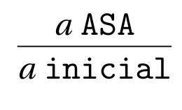
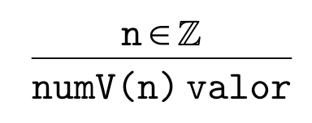
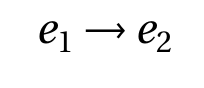
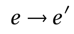
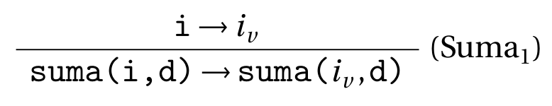
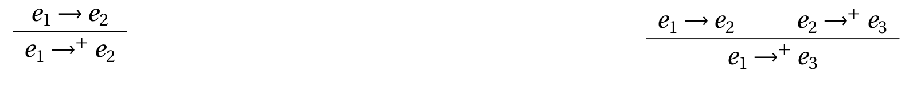
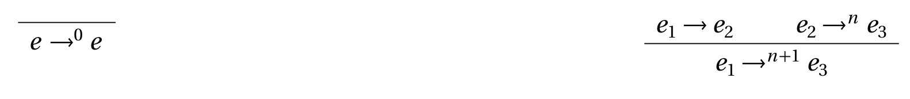

[`Lenguajes de Programación`](../../README.md) > [`Unidad 1`](../README.md) > Semántica Estructural

> 🧐 *Material tomado de las [Notas de Clase de Lenguajes de Programación](https://drive.google.com/file/d/1qptqIVrJumc8N3KLisslJjVWE1gbm90K/view) del L. en C.C. Javier Enríquez Mendoza con ligeras modificaciones.*

# Semántica Estructural

La semántica estructural es otra forma de especificar la semántica dinámica de un lenguaje. Se le conoce también con los nombres de *semántica de paso pequeño* o *de transición*. Describe paso a paso la ejecución mostrando los cómputos que genera cada paso individualmente.

## Sistema de transición para MiniLisp

Lo primero para definir la semántica estructural consiste en definir un sistema de transición que nos indique cómo pasar de un cómputo a otro paso a paso. Recordemos la definición de sistema de transición.

---

> 🌟 **Definición.**
> *Un sistema de transición es un modelo abstracto con los siguientes elementos:*
> - *Un conjunto Γ de estados.*
> - *Una función de transición.*
> - *Un conjunto finito I de estado iniciales subconjunto de Γ*

---

Es básicamente un mecanismo que nos permitirá modelar la ejecución de nuestros programas mediante un dispositivo de cómputo abstracto.

Con esto en mente, definimos el sistema de transición para MiniLisp como sigue:

---

> 🌟 **Definición.**   
> *Sistema de transición para MiniLisp:*
> - **Conjunto de estados:** *S = {a | a ASA}, es decir los estados del sistema son las expresiones bien formadas del lenguaje en sintaxis abstracta. Esta definición corresponde con la siguiente regla de inferencia:*
>   

> - **Estados iniciales:** *I = {a | a ASA}. En este caso S = I, pues podemos partir de cualquier expresión bien formada. Esta definición corresponde con la siguiente regla de inferencia:*
>    

> - **Estados finales:** *Se define como las expresiones que representan a los posibles resultados finales de un proceso de evaluación. Para poder modelarlos definimos una categoría de valores, los cuales pueden ser un subconjunto de expresiones que ya se han terminado de evaluar y no pueden reducirse más, con el juicio v valor. Para el caso de MiniLisp el único valor son los números. En general, en todos nuestros lenguajes definiremos constructores especiales para nuestros valores, añadiendo simplemente una `V` al constructor correspondiente. Deefinimos entonces nuestro único valor por medio de la regla:*
>   

>
>    _Entonces se define el conjunto de estados finales F = {a | a valor} correspondiente a la regla:_
>   

> - **Transiciones:** *La definición de las transiciones se define de acuerdo al enfoque de la semántica operacional (natural o estructural), que se da en la siguiente sección.*

---

> 💡 **Observación.**   
> Observa que el enfoque de semántica natural que definimos hace uso implícito de sistemas de transición, definiendo cómo asociar estados iniciales con estados finales.

---

## Semántica estructural para MiniLisp
Recordemos que los estados del sistema son expresiones del lenguaje, definimos entonces la siguiente relación:

como la transición del estado *e1* al estado *e2* si y sólo si en un paso de evaluación se puede reducir *e1* a *e2*. En esta relación *e1* es llamado *redex* mientras que *e2* es llamado *reducto*.

---

> 💡 **Observación.**   
> No es posible definir transiciónes en donde algún estado final sea *redex*. Es decir, no hay transiciones desde estados finales.

---

> 🌟 **Definición.**   
> *Un estado e está bloqueado si no existe otro estado e' tal que:*
> 

  
> 
> *y lo denotamos como:*
> 

  

---

Con la definición de la relación anterior se define la semántica operacional de paso pequeño como sigue.

### Reglas

- **Números.** Los números se reducen al valor correspondiente. 

	

- **Sumas.** Las sumas se dividen en tres reglas para los siguientes casos, respectivamente:

	- *Caso 1*: Ninguno de los argumentos de la suma no han sido reducidos a un valor. El paso siguiente es proceder con el lado izquiero. Por ejemplo, si tenemos `(+ (+ 3 4) (+ 5 2))` un paso de evaluación corresponde a `(+ 7 (+ 5 2))`.

		

	- *Caso 2:* El argumento izquierdo de la suma ya ha sido reducido pero el derecho no. El paso siguiente es proceder con el lado derecho. Por ejemplo, si tenemos `(+ 7 (+ 5 2))`, el lado izquiero ya es un valor, por lo que procedemos con el lado derecho con lo cual el paso corresponde a `(+ 7 7)`.

		

	- *Caso 3:* Los dos argumentos de la suma han sido reducidos a un valor. El paso siguiente es realizar la suma, tal cual. Por ejemplo, si tenemos `(+ 7 7)`, ambos argumentos ya son un valor, por lo que procedemos a sumar los mismos, obteniendo `14`.

		

- **Restas, multiplicaciones y divisiones** Las sumas, multiplicaciones y divisiones siguen el mismo razonamiento que las sumas, a continuación las reglas.

	

### La relación de transición
Dada la relación de transición → con la que se definió la semántica estructural del lenguaje, se definen inductivamente las siguientes relaciones derivadas que serán de suma para el estudio de la semántica del lenguaje.

---

> 🌟 **Definición.**   
> _Se denota a la cerradura transitiva y reflexiva por →* y se define con las siguientes reglas:_
>
> 

>
>_Intuitivamente la relación e1 →* e2 modela que es posible llegar desde e1 hasta e2 en un número finito de pasos de la relación de transición →, posiblemente cero._

---

> 🌟 **Definición.**   
> _Se denota a la cerradura transitiva por →+ y se define con las siguientes reglas:_
>
> 

>
>_Intuitivamente la relación e1 →+ e2 modela que es posible llegar desde e1 hasta e2 en un número finito de pasos de la relación de transición →, estrictamente mayor a cero, es decir, en al menos un paso._

---

> 🌟 **Definición.**   
> _Se denota a la iteración en n pasos como →n , con n un natural, y se define con las siguientes reglas:_
>
> 

>
>_Intuitivamente la relación e1 →n e2 modela que es posible llegar desde e1 hasta e2 en exactamente n pasos de la relación de transición →._

---

### Semántica natural vs. semántica estructural

---

> 👨‍🔬 **Ejemplo.**   
> Para contrastar el funcionamiento de la semántica estructural con la estructural se evalúa la expresión:
>
> 

>
> 

---

En el ejemplo anterior se aprecia que el resultado de la evaluación usando ambos estilos de semántica operaciona es el mismo, esto se puede generalizar con el sigiuente teorema:

---

> 🌟 **Teorema.**   
> *Equivalencia entre semántica natural y estructural: Para cualquier expresión e de MiniLisp se cumple:*
>
> 

>
> *Es decir, la semántica natural es equivalente a la estructural.*

---

> 🎯 **Demostración.**    
> *La demostración de este teorema se realiza mediante inducción estructural sobre los constructores del lenguaje y queda fuera del alcance de este curso, pero es importante que lxs alumnxs se convenzan de la equivalencia de la semántica.*

---

## Propiedades de MiniLisp

La relación de transición → con la que se definió la semántica natural cumple las siguientes propiedades.

---

> 🌟 **Proposición.**   
> *(Bloqueo de valores). Si v valor entonces v está bloqueado.*

---

> 🎯 **Demostración.**    
> *La demostración se realiza por análisis de casos sobre el juicio v valor.*
>
> *En este caso el único valor del lenguaje es `numV(n)` por lo que basta verificar que `numV(n)` se bloquea. Esto se cumple pues en la definición de nuestra semántica operacional no se define ninguna regla sobre el constructor `numV` por lo que no tiene transiciones definidas, de ahí que se bloquee.*

---

> 🌟 **Proposición.**   
> *(Determinismo de →). Si e → e1 y e → e2 entonces e1 = e2*. 

---

> 🎯 **Demostración.**    
> *La demostraćión se realiza por inducción sobre la relación e → e1.*
>
> *__Caso base 1:__ Num1. Esta regla indica que cualquier `num(n)` se convierte en el valor `numV(n)` lo cual es determinista al tener una única transición.*
>
> *__Caso base 2:__ Sum3. Esta regla define también una única transición, por lo tanto es determinista.*
> 
> *__Casos base 3, 4 y 5:__ Resta3, Mult3, Div3. Son análogos a los anteriores.*
>
> *__Paso inductivo:__ Suma1.*    
> *__H.I.:__ i → i', d → d' son deterministas.*   
> *Veamos que en la transición suma(i,d) → suma(iv, d), la única reducción aplicada a la expresión se da por el cambio de i hacia iv. Por lo que basta demostrar que las transiciones desde el estado i son únicas, lo cual está establecido en la H.I.*

---

> 📝 **Actividad.**   
> Completa la demostración anterior. 

---

Otra propiedad interesante es la propiedad de **terminación**. Probablemente hayas escuchado del [*probema del paro*](https://es.wikipedia.org/wiki/Problema_de_la_parada). En general, para los lenguajes de programación reales (mucho más sofisticados que MiniLisp), no se puede garantizar la terminación. Sin embargo, para el caso de nuestro lenguaje sí.

---

> 🌟 **Proposición**   
> *(Terminación). Para cada expresión e del lenguaje existe una expresión ef tal que e →* ef y ef es un estado bloqueado.  

---

> 📝 **Actividad.**   
> Demuestra la proposición anterior. 

--- 

> 📚 **Referencias.**
> 1. Javier Enríquez, *Notas de clase de Lenguajes de Programación*, Facultad de Ciencias UNAM, Revisión 2023-1.
> 1. Shriram Krishnamirthi, *Programming Languages Application and Interpretation*, Primera Edición, Brown
University, 2007.
> 1. Hanne Riis Nielson, Flemming Nielson, *Semantics with Applications: An Appetizer*, Primera Edición, Springer, 2007.

---

[`Anterior`](../tema05/README.md) | [`Siguiente`](../tema07/README.md)
