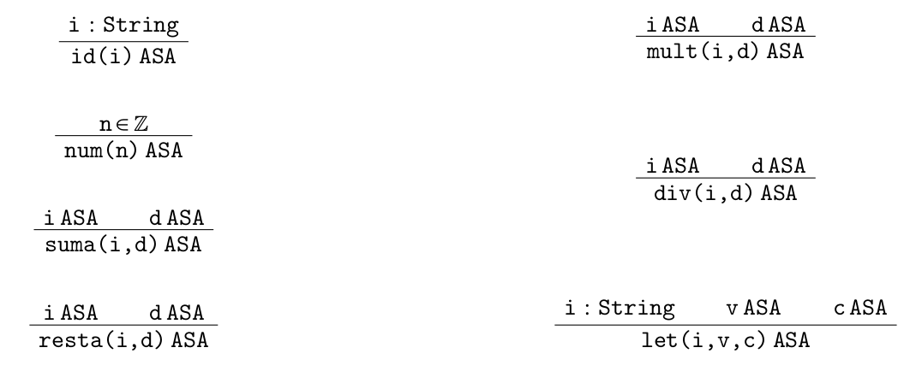

[`Lenguajes de Programación`](../../README.md) > [`Unidad 3`](../README.md) > Sintaxis

# Sintaxis

## Sintaxis concreta

Comencemos definiendo la gramática de nuestro lenguaje actualización:

```
<expr> ::= <id>
         | <num>
         | (+ <expr> <expr>)
         | (- <expr> <expr>)
         | (* <expr> <expr>)
         | (/ <expr> <expr>)
         | (let (<id> <expr>) <expr>)

<id> ::= ... | a | b | foo | hola123 | id_uno | ...         

<num> ::= ... | -1 | 0 | 1 | ...
``` 

Algunas observaciones sobre este nuevo lenguaje:

1. Tenemos una nueva regla de producción con `<id>` que genera *identificadores*. Básicamente pueden ser cualquier combinación de símbolos con la restricción de que siempre deben iniciar con una letra. Simplificamos esta parte de la gramática por practicidad.

1. De la misma forma tenemos la regla `(let (<id> <expr>) <expr>)` que genera asignaciones locales de variables. Por ejemplo:

   ```lisp
   (let (a 2)
      (+ a a))
   ```

   Que se entiende como asignar `a` con `2` y usar dicha asignación en `(+ a a)`. Hablaremos más adelante de la semántica de este constructor.

### Ejemplos

---

> 👨‍🔬 **Ejemplo.** 
>
> Algunas expresiones de este lenguaje:
>
> ```lisp
> a
> ```
>
> ```lisp
> (+ 2 (* a (/ b 10)))
> ```
>
> ```lisp
> (let (a 10)
>  (let (b 11)
>     (+ 2 (+ a (/ b 10)))))
> ```

---

## Sintaxis abstracta

Definimos a continuación nuestros árboles de sintaxis abstracta. Los árboles para identificadores capturan la variable como una cadena mientras que `let` captura tres componentes: el *identificador*, el *valor* asociado a dicho identificador y el *cuerpo* donde se usará dicha asignación.



### Ejemplos

---

> 👨‍🔬 **Ejemplo.**    
>
> Algunas expresiones de este lenguaje en sintaxis abstracta:
>
> 
> - Sintaxis concreta: `a`   
> Sintaxis abstracta: `id("a")`   
> 
>
> -   Sintaxis concreta: `(+ 2 (* a (/ b 10)))`   
> Sintaxis abstracta: `suma(num(2),mul(id("a"),div(id("b"),num(10))))`   
>
> - Sintaxis concreta:
> ```
> (let (a 10)
>  (let (b 11)
>     (+ 2 (+ a (/ b 10)))))
> ```
> Sintaxis abstracta:
> ```
> let("a", num(10),
>  let("b",num(11),
>     suma(num(2),suma(id("a"),div(id("b"),num(10))))))
> ```

---

> 📝 **Actividad.**   
> Escribe al menos 5 expresiones del lenguaje y transfórmalas a su respectiva sintaxis abstracta.

---

> 📚 **Referencias**
>
> 1. Shriram Krishnamurthi, *Programming Languages Application and Interpretation*, Brown University, Primera Edición 2007.

---

[`Anterior`](../README.md) | [`Siguiente`](../tema02/README.md)
